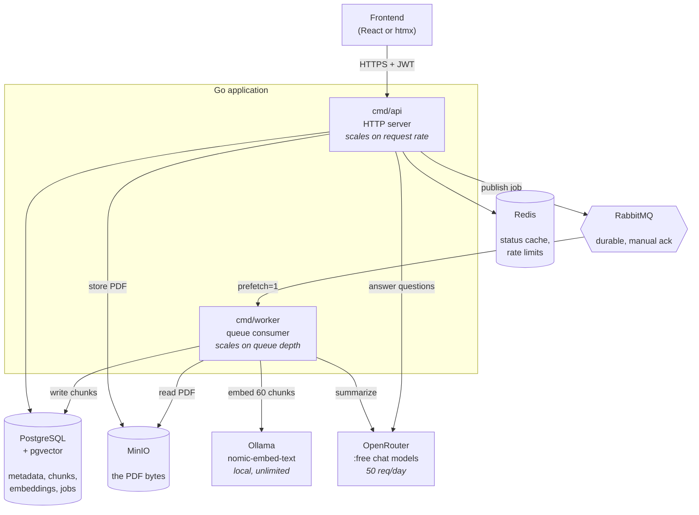

# AI Document Processing System — Design

Go backend. Upload a PDF → processed asynchronously → AI summary + question answering with citations.

Everything runs from `docker compose up`. No paid services.

---

# 1. High-Level Design

## 1.1 Components



## 1.2 Why two binaries

`cmd/api` and `cmd/worker` are separate processes sharing `internal/`.

This is the entire reason the queue exists: **request volume and processing volume are different quantities.** A burst of 500 uploads grows the queue, not your p99 latency. You scale each side on its own signal — API on request rate, worker on queue depth.

Worker is IO-bound on HTTP calls to Ollama and OpenRouter, so it sits near 5% CPU while a thousand documents wait. **Queue depth is the autoscaling signal, not CPU.**

## 1.3 What each container is for

| Container | Holds | Why not something else |
|---|---|---|
| `postgres` (pgvector) | metadata, chunks, embeddings, jobs | Vectors are a *column*, not a second database — one transaction, no drift |
| `minio` | PDF bytes | Postgres is bad at 50 MB blobs; MinIO speaks the S3 API so this is portable |
| `rabbitmq` | job messages | Durable delivery + DLQ + retry topology |
| `redis` | status cache, rate limits | Rate limits must be shared across replicas — the one thing that can't be in-process |
| `ollama` | embeddings | 60 calls per document; keeping this local is what makes the project free |

## 1.4 What Redis caches

| Key | TTL | Why it earns its place |
|---|---|---|
| `doc:{id}:status` | 2s | Polled once a second per open page — highest read volume in the system |
| `doc:{id}:summary` | 24h | Immutable once `COMPLETED`; never needs invalidating |
| `qa:{docId}:{sha256(q)}` | 6h | Turns a repeated question into 0 API calls — a **quota** control, not a latency one |
| `rl:{userId}:{window}` | rolling | Token bucket |

**Deliberately not cached:** the document list. Changes on every upload, cheap indexed query, and caching it buys an invalidation bug.

## 1.5 Go project layout

```
cmd/
  api/main.go              HTTP server
  worker/main.go           queue consumer
internal/
  config/                  env → typed config
  domain/                  Document, Chunk, Job, errors
  api/                     handlers, middleware, router (chi)
                           — named api, not http, to avoid colliding
                             with net/http at every import site
  store/                   pgx repositories
    migrations/            golang-migrate .sql files
                           — lives here because //go:embed cannot
                             reach above its own directory
  storage/                 MinIO client (S3 API)
  queue/                   publisher + consumer (amqp091-go)
  pipeline/                extract → chunk → embed → summarize
  llm/                     Embedder + Summarizer interfaces
docker-compose.yml
```

**Key libraries**

| Need | Package |
|---|---|
| Router | `go-chi/chi/v5` |
| Postgres | `jackc/pgx/v5` |
| Vectors | `pgvector/pgvector-go` |
| Queue | `rabbitmq/amqp091-go` |
| Object store | `minio/minio-go/v7` |
| JWT | `golang-jwt/jwt/v5` |
| Migrations | `golang-migrate/migrate/v4` |
| PDF text | shell out to `pdftotext` — see below |

> **PDF extraction warning.** Go has no good free PDF library. `unidoc/unipdf` requires a **paid commercial licence**. Shell out to `pdftotext` (poppler-utils) instead — free, excellent quality, and it emits `\f` between pages which gives you page numbers for citations:
>
> ```go
> out, err := exec.CommandContext(ctx, "pdftotext", "-layout", src, "-").Output()
> pages := strings.Split(string(out), "\f")
> ```
>
> Dockerfile: `RUN apk add --no-cache poppler-utils`

---

# 2. Database Design

Five tables. `vector(768)` throughout because Ollama's `nomic-embed-text` outputs 768 dimensions.

## 2.1 Schema

```sql
CREATE EXTENSION IF NOT EXISTS vector;
CREATE EXTENSION IF NOT EXISTS pgcrypto;

-- ─────────────────────────────── users

CREATE TABLE users (
    id            UUID PRIMARY KEY DEFAULT gen_random_uuid(),
    email         TEXT NOT NULL,
    password_hash TEXT NOT NULL,
    created_at    TIMESTAMPTZ NOT NULL DEFAULT now()
);

-- case-insensitive uniqueness enforced by the DB, not by app-side lowercasing
CREATE UNIQUE INDEX ux_users_email ON users (lower(email));

-- ─────────────────────────────── documents

CREATE TYPE doc_status AS ENUM
    ('UPLOADED', 'PROCESSING', 'COMPLETED', 'FAILED');

CREATE TABLE documents (
    id               UUID PRIMARY KEY DEFAULT gen_random_uuid(),
    user_id          UUID NOT NULL REFERENCES users(id),

    filename         TEXT   NOT NULL,        -- what the user called it
    storage_bucket   TEXT   NOT NULL,        -- MinIO bucket
    storage_key      TEXT   NOT NULL,        -- {userID}/{uuid}.pdf — NOT a URL
    content_type     TEXT   NOT NULL,
    file_size        BIGINT NOT NULL,
    checksum_sha256  CHAR(64) NOT NULL,
    page_count       INT,

    status           doc_status NOT NULL DEFAULT 'UPLOADED',
    summary          TEXT,
    failure_code     TEXT,                   -- machine-readable: ENCRYPTED_PDF
    failure_detail   TEXT,                   -- human-readable

    -- lease: which worker owns this document, and until when
    lease_owner      TEXT,
    lease_expires_at TIMESTAMPTZ,

    created_at       TIMESTAMPTZ NOT NULL DEFAULT now(),
    updated_at       TIMESTAMPTZ NOT NULL DEFAULT now(),
    deleted_at       TIMESTAMPTZ
);

CREATE INDEX ix_docs_user ON documents (user_id, created_at DESC)
    WHERE deleted_at IS NULL;

-- lets the sweeper find stranded work cheaply
CREATE INDEX ix_docs_stranded ON documents (status, updated_at)
    WHERE status IN ('UPLOADED', 'PROCESSING');

-- same PDF twice = reuse, skip the whole pipeline
CREATE UNIQUE INDEX ux_docs_dedupe ON documents (user_id, checksum_sha256)
    WHERE deleted_at IS NULL;

-- ─────────────────────────────── chunks

CREATE TABLE document_chunks (
    id          BIGSERIAL PRIMARY KEY,
    document_id UUID NOT NULL REFERENCES documents(id) ON DELETE CASCADE,
    chunk_index INT  NOT NULL,
    content     TEXT NOT NULL,

    page_from   INT  NOT NULL,     -- citations are impossible without these
    page_to     INT  NOT NULL,
    token_count INT  NOT NULL,

    embedding   vector(768),       -- nomic-embed-text. The vector IS a column.
    created_at  TIMESTAMPTZ NOT NULL DEFAULT now(),

    -- reprocessing cannot produce duplicate chunks
    CONSTRAINT ux_chunk UNIQUE (document_id, chunk_index)
);

CREATE INDEX ix_chunks_doc ON document_chunks (document_id);

-- Add this only when you can measure it helping. At a few hundred vectors
-- per document an exact scan is fast, and HNSW + a narrow WHERE filter
-- silently loses recall.
-- CREATE INDEX ix_chunks_vec ON document_chunks
--     USING hnsw (embedding vector_cosine_ops);

-- ─────────────────────────────── jobs

CREATE TABLE jobs (
    id            UUID PRIMARY KEY DEFAULT gen_random_uuid(),
    document_id   UUID NOT NULL REFERENCES documents(id) ON DELETE CASCADE,
    job_type      TEXT NOT NULL,          -- PROCESS_DOCUMENT
    status        TEXT NOT NULL,          -- PENDING RUNNING SUCCEEDED FAILED DEAD
    stage         TEXT,                   -- resumption checkpoint
    attempts      INT  NOT NULL DEFAULT 0,
    max_attempts  INT  NOT NULL DEFAULT 5,
    last_error    TEXT,
    next_retry_at TIMESTAMPTZ,
    created_at    TIMESTAMPTZ NOT NULL DEFAULT now(),
    updated_at    TIMESTAMPTZ NOT NULL DEFAULT now(),

    CONSTRAINT ux_job UNIQUE (document_id, job_type)
);

CREATE INDEX ix_jobs_pending ON jobs (status, created_at)
    WHERE status = 'PENDING';

-- ─────────────────────────────── questions

CREATE TABLE questions (
    id                UUID PRIMARY KEY DEFAULT gen_random_uuid(),
    document_id       UUID NOT NULL REFERENCES documents(id) ON DELETE CASCADE,
    user_id           UUID NOT NULL REFERENCES users(id),

    question          TEXT NOT NULL,
    question_hash     CHAR(64) NOT NULL,   -- sha256(lowercased, trimmed)
    answer            TEXT NOT NULL,
    citations         JSONB NOT NULL,      -- [{chunkId, page, snippet}]

    model             TEXT NOT NULL,       -- which OpenRouter model answered
    prompt_tokens     INT,
    completion_tokens INT,
    latency_ms        INT,
    created_at        TIMESTAMPTZ NOT NULL DEFAULT now()
);

CREATE INDEX ix_q_cache ON questions (document_id, question_hash);
```

## 2.2 Design notes

**The embedding is a column, not a foreign key.** A separate vector store would make every chunk write a dual write across two systems with no shared transaction — partial state becomes normal. With pgvector it's one insert.

**Store bucket + key, never a URL.** URLs are a rendering, not an identity. Presigned URLs expire in minutes. Generate on read.

**Page numbers ride along from extraction.** `pdftotext` gives you `\f` page separators; carry `page_from`/`page_to` through chunking. Without this your `sources` field is decoration you can't verify.

**`storage_key` is `{userID}/{uuid}.pdf`.** Never the user's filename — that's a path-traversal surface for free.

**`jobs` doubles as your outbox.** Insert the job row in the *same transaction* as the document, then publish. If the publish fails, a sweeper republishes any `PENDING` job older than 2 minutes. Closes the dual-write gap with no extra table.

## 2.3 The query that matters

```sql
SELECT id, content, page_from, page_to,
       1 - (embedding <=> $1) AS similarity
FROM   document_chunks
WHERE  document_id = $2
ORDER  BY embedding <=> $1
LIMIT  8;
```

`<=>` is cosine distance. Always scope by `document_id` — that filter is both a correctness requirement and a tenancy boundary.

---

# 3. API Design

Base path `/api/v1`. JSON in, JSON out. Bearer JWT except on auth routes.

## 3.1 Surface

| Method | Path | Returns | Notes |
|---|---|---|---|
| POST | `/auth/register` | 201 | bcrypt cost 12 |
| POST | `/auth/login` | 200 | JWT, 15 min expiry |
| POST | `/documents` | **202** | multipart; `Idempotency-Key` accepted |
| GET | `/documents` | 200 | cursor pagination |
| GET | `/documents/{id}` | 200 · 404 | 404 — never 403 — if not yours |
| DELETE | `/documents/{id}` | 204 | soft delete |
| GET | `/documents/{id}/status` | 200 | hot path, Redis-cached 2s |
| GET | `/documents/{id}/summary` | 200 · 409 | 409 while still processing |
| GET | `/documents/{id}/download` | 302 | redirect to 60s presigned URL |
| POST | `/documents/{id}/questions` | 200 · 429 | **synchronous** |
| GET | `/documents/{id}/questions` | 200 | history |
| POST | `/documents/{id}/retry` | 202 | only from `FAILED` |
| GET | `/healthz` | 200 | liveness |

## 3.2 Upload — why 202

```http
POST /api/v1/documents
Content-Type: multipart/form-data
Idempotency-Key: 9f2c-…

→ 202 Accepted
  Location: /api/v1/documents/d1/status

{
  "documentId": "d1",
  "status": "UPLOADED",
  "statusUrl": "/api/v1/documents/d1/status"
}
```

`202` means *"I durably recorded your intent; the work hasn't happened."* Processing takes 10–90s and scales with document size; an HTTP request shouldn't. This keeps the API's cost per upload constant.

The handler does exactly four things, then returns:

```
1. validate  (magic bytes %PDF-, size ≤ 25 MB)
2. PUT to MinIO
3. BEGIN → insert documents + insert jobs → COMMIT
4. publish to RabbitMQ
```

Steps 3 and 4 are the dual-write gap. The job row committing with the document is what makes it recoverable.

## 3.3 Status — the busiest endpoint

```http
GET /api/v1/documents/d1/status

→ 200 OK
{
  "documentId": "d1",
  "status":     "PROCESSING",
  "stage":      "EMBEDDING",
  "progress":   { "done": 18, "total": 60 },
  "attempt":    1,
  "updatedAt":  "2026-09-04T09:12:44Z"
}
```

Every open document page polls this every second. It's a single row that changes ~6 times in a document's life — **cache it in Redis for 2s.** Returning `stage` and `progress` is what lets the UI show a real progress bar instead of an indefinite spinner.

## 3.4 Questions — why this one is synchronous

```http
POST /api/v1/documents/d1/questions
{ "question": "Why does it recommend async processing?" }

→ 200 OK
{
  "answer": "The document argues async processing avoids tying up a
             request thread for the full 30s of work [1], and lets
             processing capacity scale separately from the API [2].",
  "sources": [
    { "page": 12, "snippet": "Asynchronous processing allows…" },
    { "page": 19, "snippet": "Message queues decouple…" }
  ],
  "cached": false,
  "latencyMs": 2840
}
```

Looks inconsistent with the 202 upload. It isn't. The rule is:

> Go async when the work **outlives a reasonable request**, *or* when **nobody is waiting**.

Upload is 10–90s and the user has navigated away. A question is 2–4s and the user is watching a spinner they asked for. Making it async would add a job table, polling, and a websocket to deliver something that fits in one request.

Upgrade path is **SSE streaming**, not a queue.

## 3.5 Errors

RFC 7807 `application/problem+json`, with a stable machine-readable `code`:

```json
{
  "type":   "https://docs.example/errors/document-not-ready",
  "title":  "Document is still processing",
  "status": 409,
  "code":   "DOCUMENT_NOT_READY",
  "detail": "Summary is available once processing completes.",
  "instance": "/api/v1/documents/d1/summary"
}
```

| Code | HTTP | When |
|---|---|---|
| `VALIDATION_FAILED` | 400 | bad payload, not a PDF |
| `UNAUTHENTICATED` | 401 | missing/expired JWT |
| `NOT_FOUND` | 404 | missing **or not yours** |
| `DOCUMENT_NOT_READY` | 409 | summary/questions before `COMPLETED` |
| `FILE_TOO_LARGE` | 413 | over 25 MB |
| `RATE_LIMITED` | 429 | + `Retry-After` header |
| `LLM_UNAVAILABLE` | 503 | OpenRouter down / circuit open |

## 3.6 Conventions

**Ownership lives in the SQL, not in Go.**

```go
// every document-scoped query carries the user
const q = `SELECT … FROM documents WHERE id = $1 AND user_id = $2
           AND deleted_at IS NULL`
```

A fetch-then-compare in the handler is one forgotten early-return away from an IDOR. And `userID` always comes from the validated JWT subject — never from the request body or path.

**404, not 403.** A 403 confirms the ID exists. That's an enumeration oracle.

**Cursor pagination**, keyed on `(created_at, id)`:

```http
GET /api/v1/documents?limit=20&cursor=eyJ0IjoiMjAyNi0wOS0wNF…

→ { "items": [...], "nextCursor": "eyJ0IjoiMjAyNi0wOS0wM…" }
```

Offset pagination skips and repeats rows when new documents land mid-scroll.

**Rate limits** (Redis token bucket, per user):

| Action | Limit | Why |
|---|---|---|
| Upload | 10 / day | Bounds embedding volume |
| Questions | 20 / hour | OpenRouter free tier is 50 requests/day total |
| File size | 25 MB | Enforced before spending a single API call |

---

# 4. Cross-references

Async architecture, idempotency, the lease, retry topology and the failure matrix are unchanged by the Go rewrite — see the blueprint document.

The one Go-specific note: the lease claim is still a single conditional `UPDATE`, and `pgx` returns the affected row count so you can branch on it directly:

```go
tag, err := tx.Exec(ctx, claimSQL, workerID, docID)
if tag.RowsAffected() == 0 {
    // someone else owns it, or it's already done — ack and return
    return nil
}
```
